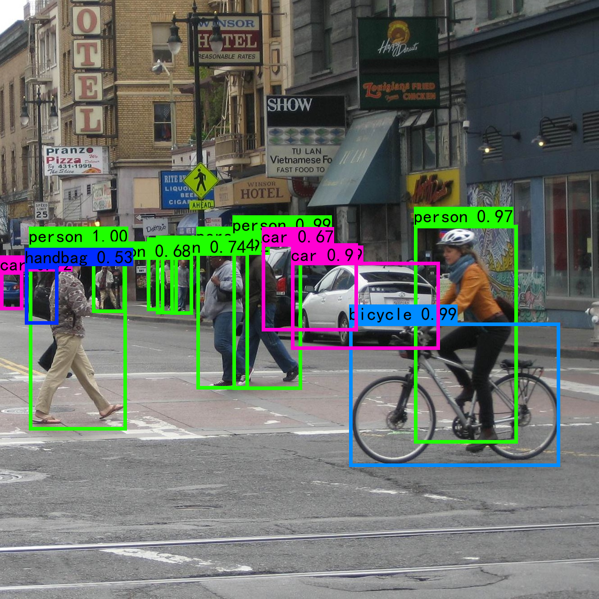
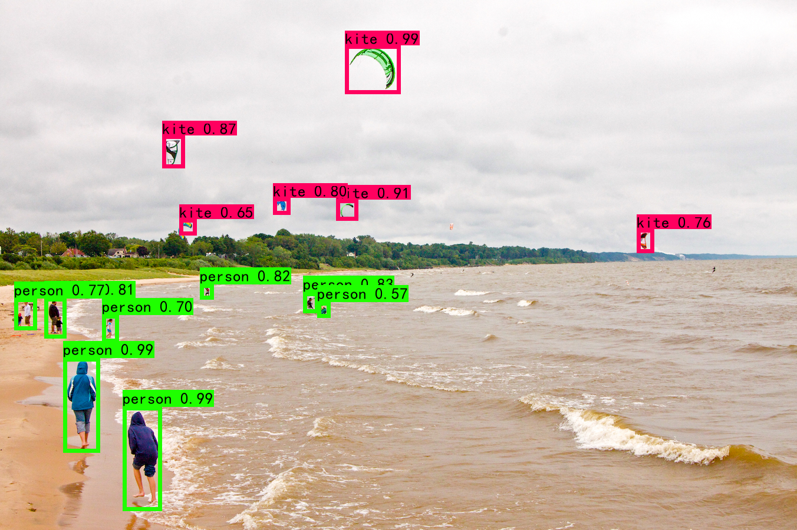

# yolov4-tensorflow2

This is a re-implementation of yolov4, using `tensorflow2.2`. :star:

Various tricks in the paper are implemented. You can train a custom data set by specifying the classes file. The perfomance can reach **19~22fps** in single thread, while the hardware configuration is **Intel(R) Core(TM) i5-10300H CPU @ 2.50GHz 2.50 GHz, GeForce GTX 1660Ti, RAM 16G**.:collision:

I also made some notes, which is some experience in model training, click [here](./yolov4-notes.md) to view.:notebook_with_decorative_cover:

Contact the author: qq: 419289453

## Directory:bookmark_tabs:

1. [Demo](#Demo)

2. [Requirements](#Requirements)

3. [Quick-Start](#Quick-Start)

4. [Work](#Work)

5. [Note](#Note)

6. [Train](#Train)

7. [Test](#Test)

## Demo






## Requirements

Python 3.7.7+

tensorflow-gpu 2.2.0+

Pillow 7.1.2+

```shell
python install -r requirements.txt
```

## Quick-Start

1. Clone this repository :sunny:

```
git clone https://github.com/NiceRingNode/yolov4-tensorflow2
```

2. Download pretrained weights [here](https://pan.baidu.com/s/12O-z209z6xNORplENeFsdw), extract code: a768. This directory contains two `.h5 ` files, 

| pretrained weights name | dataset based         | classes number |
| ----------------------- | --------------------- | -------------- |
| yolov4_voc_weights.h5   | VOC2007+2012+COCO2014 | 20             |
| yolov4_coco_weights.h5  | COCO2017              | 80             |

3. Put the weights files in folder `model_data` and put image for inference test in folder `img` 
4. Change working directory in cmd, 

```shell
cd/d yolov4-tensorflow2
```

​		and run `predict.py` 

```shell
python predict.py --img_root <your path of the image>
```

​		or just type

```shell
python predict.py
```

## Work

- [x] CSPDarkNet53 :ocean:

- [x] PAN, SPP :zap:

- [x] Mish Activation Layer :art:

- [x] CIOU :camera:

- [x] Label Smoothing :scroll:

- [x] Mosaic Data Augmentation :sheep:

- [x] Cosine Decay :ear_of_rice:

- [x] LetterBox Image :blowfish:

## Note

The pretrained weights `yolov4_coco_weights.h5` are trained based on images that have size 608×608，but it was modified to 416×416 in the code while the anchors are calculated in the size of 608×608. You can change it to 608×608 if needed.

## Train

1. Here we use the **VOC2007** or **VOC2012** dataset to train the model, so download the [VOC](http://host.robots.ox.ac.uk/pascal/VOC/) dataset and put it under the root directory.
2. Here we use the pretrained model to finetune, so we should download the pretrained weights, and put them in the folder `model_data`.

```
├─demo
├─font
├─img
├─logs
├─model_data
│  ├─coco_classes.txt
│  ├─voc_classes.txt
│  ├─yolov4_coco_weights.h5
│  ├─yolov4_voc_weights.h5
│  └─yolo_anchors.txt
├─video
└─VOCdevkit
    └─VOC2007
```

2. Change working directory in cmd, and run `voc2yolov4.py`

```
python voc2yolov4.py
```

3. Then run `voc_annotations_convert.py`, now the data format is converted to `<image path> xmin ymin xmax ymax class_id`

```
python voc_annotations_convert.py
```

4. As data prepared, we can now begin training. :shell:

```
python train.py --classes_path <the path of classes file> --pretrained_weights_path <the path of pretrained weights> --logs_path <the path of storing log files> --batch_size 2 --epoch 100
```

If you want to train the model on custom dataset, you should change the root of dataset, and specify the classes file when training by modifying the --classes_path argument.

or just

```
python train.py
```

## Test

This step is similar to Quick Start, but you can use the pretrained weights trained by yourself instead of the pretrained weights downloaded above. Also you can run `video.py` to test the real-time performance.

```
python video.py
```

